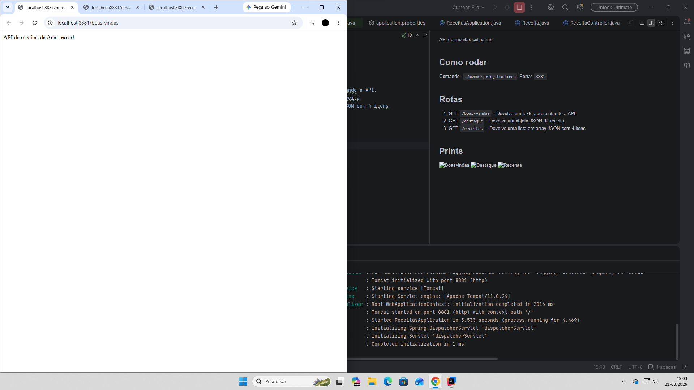
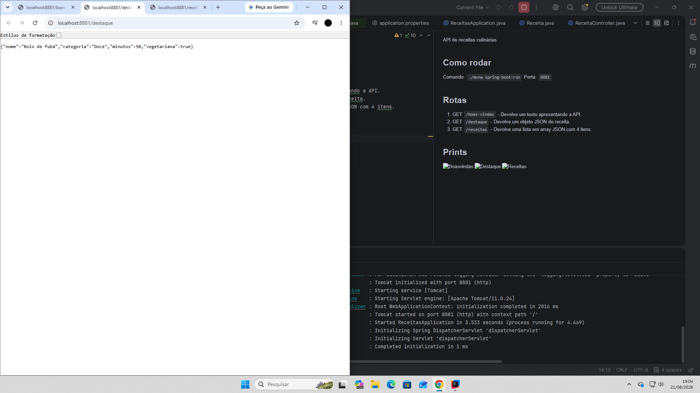
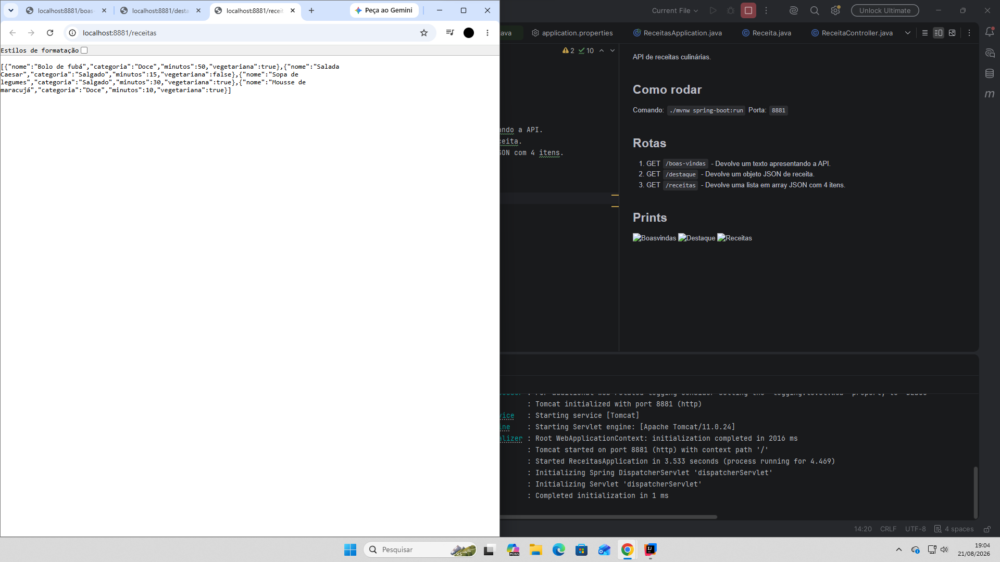

API de receitas culinárias.

## Como rodar
Comando: `./mvnw spring-boot:run`
Porta: `8881`

## Rotas
1. GET `/boas-vindas` - Devolve um texto apresentando a API.
2. GET `/destaque` - Devolve um objeto JSON de receita.
3. GET `/receitas` - Devolve uma lista em array JSON com 4 itens.

## Prints

